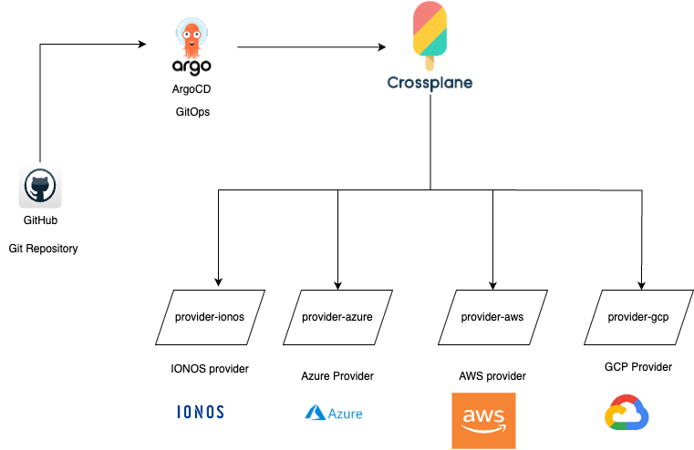

# platform-template
A Platform Template with ArgoCD and Crossplane in a multi-cloud environment

## Architecture (for Multi-cloud)

The architecture for the Platform can be found below:



## Tools used/Required

* `kubectl` CLI ([Linux](https://kubernetes.io/docs/tasks/tools/install-kubectl-linux/), [Windows](https://kubernetes.io/docs/tasks/tools/install-kubectl-windows/), [MacOS](https://kubernetes.io/docs/tasks/tools/install-kubectl-macos/))
* `argocd` CLI (can be found [here](https://argo-cd.readthedocs.io/en/stable/cli_installation/))
* `kind` CLI (can be found [here](https://kind.sigs.k8s.io/docs/user/quick-start/#installation))

## GitOps

Before we dive into the installation steps and get our hands dirty, we need to understand what is the motivation
behind using ArgoCD? What actually is ArgoCD? What is Crossplane?

ArgoCD is a GitOps tool which manages infrastructure on committing changes to GitHub repository. It is
always connected to GitHub Repository and based on the branch that it is told to make changes to infrastructure,
it will only manage when committing changes to that branch.

But why GitOps? Why not use any other CI/CD tool like Azure DevOps, GitHub Actions or Gitlab CI/CD?
The motivation of GitOps is mostly for any infrastructure changes. Unlike the traditional CI/CD tool,
we rarely make changes to Infrastructure in any environment. Additionally, GitOps have a quicker update
than a traditional CI/CD tool.

Secondly, Crossplane is an IaC tool which utilizes a Kubernetes cluster to store the state instead of a container
(z. B. S3 for AWS, Azure Blob Storage for Azure). It is beneficial for cloud native environment because as a DevOps engineer,
when any changes to infrastructure is made unintensionally, it messes up the entire state unlike Pulumi and Terraform, which
are good tools as well.

Henceforth, Combining Crossplane and ArgoCD, you can make changes to infrastructure by using PRs to review changes and
merging changes to the branch you would want to manage infrastructure as you want.

## Initial Installation

*Note: This installation only covers installation of ArgoCD and Crossplane*

### Scripting

You can run the following script to install cluster with ArgoCD and Crossplane:

```shell
./scripts/initialize_argocd.sh
```

### Step-by-Step

If you would like to follow the traditional approach, you can follow [this page](STEPS_README.md)

### Configuring Provider

In this project, we are following the ArgoCD [App of App](https://argo-cd.readthedocs.io/en/stable/operator-manual/cluster-bootstrapping/) and [sync waves](https://argo-cd.readthedocs.io/en/stable/user-guide/sync-waves/) approach

Steps:
1. Create a `provider-config.yaml` file in `gitops/applications` directory
2. Copy the contents of `argo-config.yaml` file within the `gitops/applications` directory
3. Create a folder under `gitops/manifests` to the cloud provider (z.B. `provider-aws` for aws )
4. Replace the `path` from `gitops/manifests/argo-config` to the newly created path
5. Update the `metadata.name` to `provider-config`
6. Create a Provider yaml file (you can find the provider from [here](https://marketplace.upbound.io/providers)) depending on which resource is expected
    ```shell
    apiVersion: pkg.crossplane.io/v1
    kind: Provider
    metadata:
      name: provider-aws-s3
    spec:
      package: xpkg.upbound.io/upbound/provider-aws-s3:v0.42.0
    ```
7. Commit and push the changes
8. Check the changes in ArgoCD console (http://argocd.127.0.0.1.nip.io)
9. After the changes are synchronized and applied, create a credentials file in your local directory (reference: [aws credentials](https://docs.crossplane.io/v1.13/getting-started/provider-aws/#generate-an-aws-key-pair-file))
10. You can create the secret using the following command:
    ```shell
    kubectl create secret generic aws-secret \
        -n crossplane-system \
        --from-file=creds=./aws-credentials.txt
    ```
11. Create the Provider config file (a sample for AWS is found below):
    ```shell
    apiVersion: aws.upbound.io/v1beta1
    kind: ProviderConfig
    metadata:
      name: default
    spec:
      credentials:
        source: Secret
        secretRef:
          namespace: crossplane-system
          name: aws-secret
          key: creds
    ```
12. Repeat steps 7-8
13. After it is synchronized, you are ready to create cloud resources.
14. Please follow the steps 1-5 for the cloud resource and then steps 7-8 for changes

Now you can see the changes in your cloud resources and Viola!